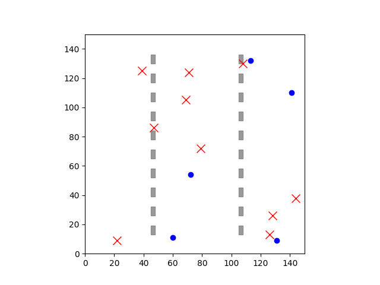

# DC-MRTA



A Python-based implementation and visualization of **DC-MRTA** (Decentralized Multi-Robot Task Allocation and navigation) in complex environments.

## Overview

This repository contains code for running a warehouse-style multi-robot simulation where agents pick up and deliver tasks in a decentralized manner, avoid obstacles, and automatically reassign themselves when tasks complete.

## Files

- **main.py**  
  - Tkinter-driven UI to configure number of agents, tasks, and simulation speed  
  - Saves `start.png`, `end.png`, and `simulation.gif`  
- **simulation.py**  
  - Standalone script for running the simulation without UI  
- **navigation.py**  
  - A* pathfinder and ORCA-style collision stub  
- **task_allocation.py**  
  - Greedy and nearest-task allocation helpers  
- **utils.py**  
  - Environment initialization and distance calculations  
- **.gitignore**  
  - Excludes Python cache files (`__pycache__/`, `*.pyc`)  
- **start.png**, **end.png**, **simulation.gif**  
  - Example outputs generated by `main.py`

## Requirements

- Python 3.7+  
- Matplotlib  
- Pillow  

Install dependencies:

```bash
pip install matplotlib pillow
